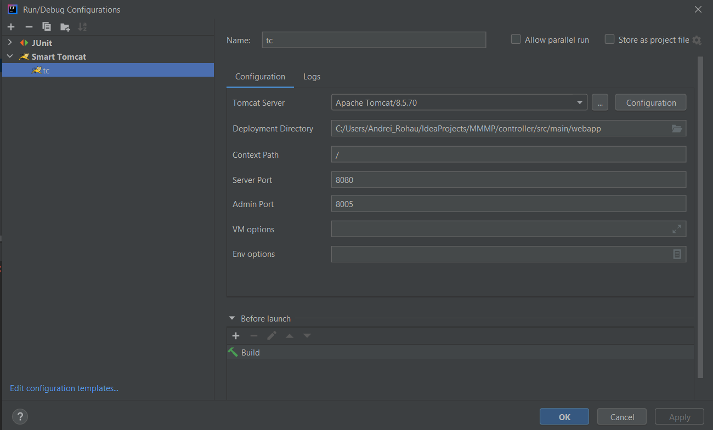

READ ME
---

RUN PROJECT STEPS:
    
- download & install java (jdk1.8.0_301)
- download & install apache tomcat (apache-tomcat-8.5.70)
- set up run configuration 
---

DATABASE:

- properties file location: dao/src/main/resources/db.properties
- database structure folder location: dao/src/main/resources/database-structure/
- #todo set up database
---
